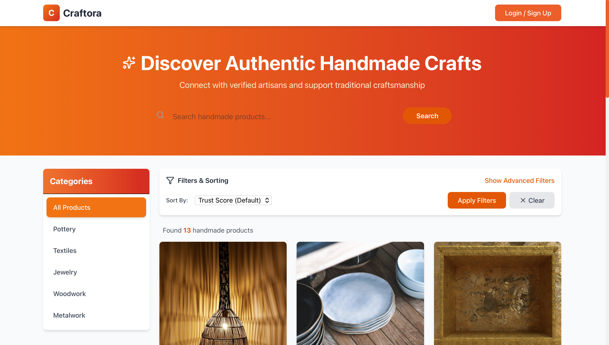
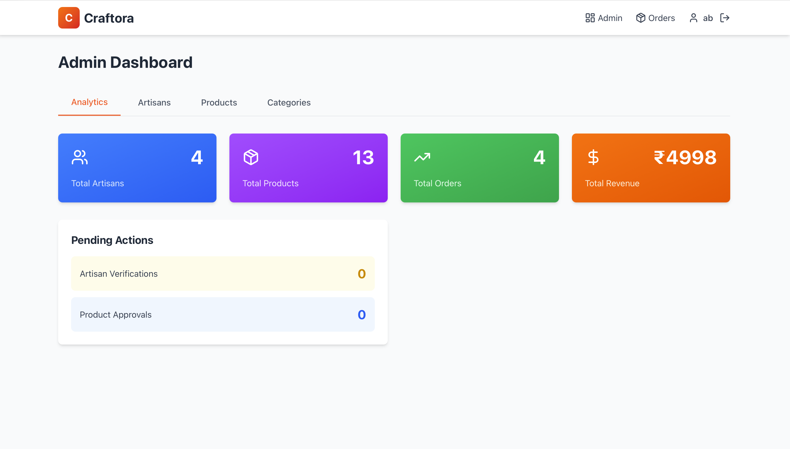
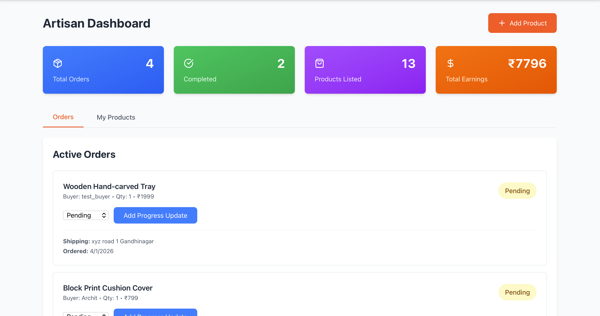

# Craftora - Trust-First Marketplace for Handmade Crafts 🎨
## Please Access the Craftora for this link: https://craftora-swart.vercel.app



## 🎯 The Problem

Traditional handmade marketplaces lack **trust** and **transparency**. Buyers can't verify authenticity, artisans lack visibility, and the crafting process remains invisible.

## 💡 Our Solution

Craftora introduces **trust-first commerce** through:
- **Live crafting progress** with stage-by-stage photo updates
- **Video calls** with artisans to see workshops and ask questions
- **AR try-on** to visualize products before buying
- **AI-powered trust scores** based on verification and reviews
- **Fair pricing transparency** showing material, labor, and platform costs

---

## ✨ Key Features

### 🔐 Trust & Authenticity
- **Artisan Verification System**: Admin-approved artisan profiles with ID verification and craft validation
- **Confidence Score (0-100)**: AI calculates trust based on verification status, completion rate, ratings, and review count
- **Fair Price Breakdown**: Transparent display of material cost, artisan labor, and 10% platform fee
- **Verified Badges**: Blue checkmarks for verified artisans visible across the platform

### 📦 Order & Tracking
- **Real-Time Order Tracking**: Watch your order move through pending → confirmed → crafting → shipping → delivered
- **Live Crafting Updates**: Artisans upload photos at each stage (clay prep, shaping, painting, firing, etc.)
- **Progress Timeline**: Visual timeline showing all updates with timestamps and descriptions
- **AI Delivery ETA**: Smart prediction based on crafting time + historical shipping data

### 🎥 Live Video Calls (WOW Feature #1)
- **One-Click Request**: Buyers click "Video Call with Artisan" from any product page
- **Instant Notifications**: Artisans see animated notification banner on dashboard with buyer name
- **Auto-Connect**: When artisan accepts, both join the same Jitsi video room automatically
- **No Login Required**: Seamless WebRTC connection without external account setup

### ✨ AR Try-On (WOW Feature #2)
- **Camera-Based Visualization**: See products overlaid on yourself using device camera
- **3 Overlay Modes**: Jewelry (neck), Textile (body), Decor (held in hand) positioning
- **Capture & Download**: Take photos with product overlay and save to device
- **Social Sharing Ready**: Downloaded images perfect for Instagram/Facebook

### 🤖 AI-Powered Intelligence
- **Product Story Generator**: AI creates SEO-friendly descriptions from craft type, region, and materials
- **Sentiment Analysis**: Reviews auto-analyzed for sentiment score (rating × 20%)
- **Smart Search**: Search products by name/description with relevance matching
- **Trust Scoring Algorithm**: Multi-factor calculation updated after each order/review

### 🔍 Discovery & Search
- **Advanced Filters**: Filter by price range, craft type, region, category
- **Multi-Sort Options**: Sort by trust score, rating, price (low/high), newest
- **Category Sidebar**: Dynamic category navigation loaded from database
- **Responsive Search**: Large hero search bar with instant results

### 👥 User Roles & Dashboards

**Buyer Dashboard**:
- Order history with status badges and delivery tracking
- One-click order detail view with full progress timeline
- Review submission for delivered orders

**Artisan Dashboard**:
- Stats overview (total orders, completed, products listed, earnings)
- Order management with status update dropdowns
- Progress update form (stage name, description, photo URL)
- Product listing with approval status (pending/approved badges)
- Video call notifications with accept button

**Admin Dashboard**:
- Platform analytics (total artisans, products, orders, revenue)
- Pending artisan verifications with document links
- Pending product approvals with artisan details
- Category management and creation
- One-click verify/approve actions

### 💬 Reviews & Ratings
- **5-Star Rating System**: Interactive star selector with visual feedback
- **Rich Review Comments**: Text-based reviews with optional media URLs
- **User Attribution**: Reviews show buyer name and submission date
- **Auto-Update Ratings**: Product ratings recalculated after each review


---

## 🛠️ Tech Stack

### Backend
- **Language**: Go 1.21+ with standard library HTTP server
- **Authentication**: JWT tokens with bcrypt password hashing
- **Database**: PostgreSQL (Neon serverless recommended)
- **Architecture**: Clean layered architecture (handlers → models → database)

### Frontend
- **Framework**: React 18 with Vite for fast dev experience
- **Styling**: Tailwind CSS with Taobao orange (#ff5000) theme
- **HTTP Client**: Axios with interceptors for auth tokens
- **Routing**: React Router v6 with protected routes
- **Video**: Jitsi Meet SDK (@jitsi/react-sdk)

### Database Schema
- **7 Tables**: users, artisans, categories, products, orders, order_progress, reviews, video_call_requests
- **Indexes**: Optimized queries on artisan_id, category_id, product_id, user_id
- **Relationships**: Proper foreign keys with CASCADE deletes

---

## 🚀 Quick Start

```bash
# Clone repository
git clone <your-repo-url>
cd craftora

# Backend setup
cd backend
go mod download
# Create .env with DATABASE_URL, JWT_SECRET, PORT
go run cmd/server/main.go

# Frontend setup (new terminal)
cd frontend
npm install
npm install @jitsi/react-sdk  # For video calls
# Create .env with VITE_API_URL
npm run dev
```


## 📱 User Workflows

### Buyer Journey
1. **Browse** → Search/filter products by category, price, craft type, region
2. **Discover** → View product details, trust score, price breakdown, artisan profile
3. **Connect** → Request video call OR try AR try-on for visualization
4. **Order** → Add quantity, enter shipping address, place order
5. **Track** → Watch real-time crafting progress with artisan photos
6. **Review** → Rate and review after delivery

### Artisan Journey
1. **Register** → Sign up with "Artisan" role selected
2. **Onboard** → Complete profile (business name, craft type, region, bio, verification docs)
3. **Verify** → Wait for admin verification (typically 24 hours)
4. **List** → Add products with AI-generated stories, pricing, images
5. **Approve** → Admin approves products for marketplace visibility
6. **Fulfill** → Receive orders, update status, upload crafting progress photos
7. **Connect** → Accept video call requests from interested buyers
8. **Earn** → View earnings dashboard and order history

### Admin Journey
1. **Monitor** → View platform analytics and pending actions
2. **Verify** → Review and approve artisan applications with document checks
3. **Approve** → Review and approve product listings for quality
4. **Manage** → Create new categories, handle disputes, monitor reviews

---

## 🎯 Unique Selling Points

1. **Live Crafting Visibility**: Only marketplace showing real-time creation process with photos
2. **Video Call Integration**: Direct buyer-artisan connection without external platforms
3. **AR Try-On**: Camera-based product visualization unavailable elsewhere
4. **AI Trust Scoring**: Multi-factor algorithmic trust calculation updated live
5. **Fair Pricing**: Complete cost transparency builds buyer confidence
6. **Artisan-First**: Designed with artisan needs in mind (simple dashboard, photo uploads)

---


## 🔮 Future Enhancements

- **Payment Gateway**: Razorpay/Stripe integration for checkout
- **Email Notifications**: Order confirmations and status updates
- **Chat System**: Real-time messaging between buyers and artisans
- **Image Upload**: Cloud storage (Cloudinary/S3) instead of URLs
- **Multi-Language**: Hindi, Tamil, Bengali support
- **Mobile Apps**: React Native iOS/Android apps
- **Wishlist**: Save favorite products for later
- **Gift Wrapping**: Premium packaging options

---


**Made with ❤️ for artisans, by developers who care about preserving traditional crafts**
